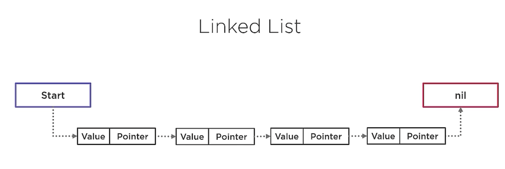

# go-adv-branching-and-looping

## Looping

#### Linked List
A linked list is a special king of list which holds records of structure, usually two fields, one field to hold data and another field is a pointer to another of these records. It creates a chain until the last pointer is nil. Its dynamic, as long as free memory is available, you can make the last pointer point to a newly created record memory address. 

A double linked list is when each record has pointers in both directions. 