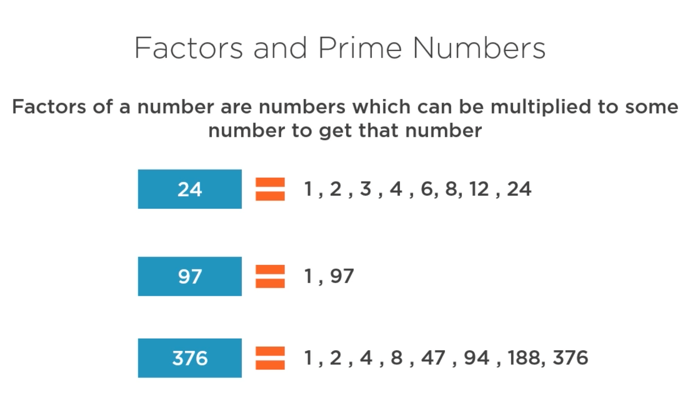
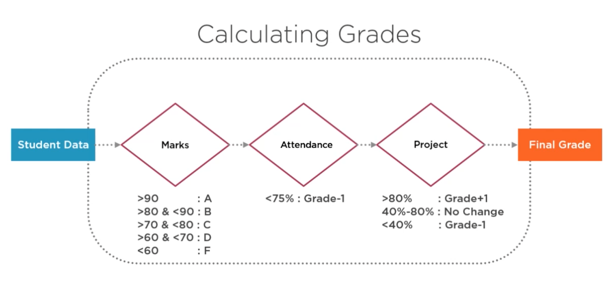

# go-adv-branching-and-looping

## Factors and Prime Numbers 
For `factor.go`:

97 is a prime number. Only has two factors, 1 and itself.

## Calculating Grades
For `grades.go`:

The beauty of this function is that the business logic can change within the function and is abstracted and the user is only concerned with the input values.